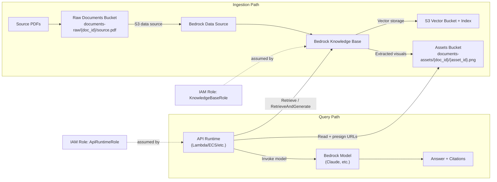

# Evidentia CDK (Phase 1 Foundation)

This CDK app provisions the Phase 1 AWS foundation for the Evidentia MVP:

- S3 buckets for raw documents and extracted visual assets
- S3 Vector Bucket + Vector Index for S3 Vectors storage (KB vector store backend)
- IAM role for Bedrock Knowledge Base access (raw docs + assets paths)
- IAM role for API runtime access (asset reads/presigning + Bedrock invoke/retrieve)
- Stack outputs for runtime configuration wiring
- Bedrock Knowledge Base + S3 data source resources (required for full query path, toggleable for staged deploys)

## Bedrock KB Deployment Modes

For the Evidentia query pipeline, these components are essential:

- Bedrock Knowledge Base (`VECTOR`)
- S3 Vectors storage configuration (`S3_VECTORS`)
- Bedrock S3 data source (`S3`)

The `enableBedrockKb` toggle exists to support staged deployment and troubleshooting:

- `enableBedrockKb=false`: foundation-only deploy (buckets, vector bucket/index, IAM roles)
- `enableBedrockKb=true`: full KB deploy (required for retrieval + grounded answer flow)

The stack defaults to `false` because KB creation requires environment-specific values (for example an embedding model ARN and parsing settings).

## What Bedrock S3 Data Source Is For

The Bedrock S3 data source defines what the KB ingests:

- points the KB to the raw documents S3 location (`documents-raw/...`)
- applies inclusion prefixes for which objects should be ingested
- is the resource Bedrock ingestion jobs run against to chunk/embed/index documents

Without a data source, the KB exists but has no document corpus to ingest.

## Architecture Flow



## Setup, Deploy, and Sync `.env`

Use this flow for first-time setup and for redeploy after cleanup.

1. Deploy full foundation + KB/data source from `infra/cdk`:

```bash
cd infra/cdk
python3 -m venv .venv
. .venv/bin/activate
pip install -e .
set -a; source ../../.env; set +a

export AWS_REGION=us-east-1
export CDK_DEFAULT_ACCOUNT="$(aws sts get-caller-identity --query Account --output text)"
export CDK_DEFAULT_REGION="$AWS_REGION"

cdk bootstrap "aws://${CDK_DEFAULT_ACCOUNT}/${CDK_DEFAULT_REGION}"
cdk synth --app ".venv/bin/python app.py" -c stage=dev -c enableBedrockKb=true
cdk deploy --app ".venv/bin/python app.py" -c stage=dev -c enableBedrockKb=true
```

Troubleshooting-only variant (foundation resources without KB/data source):

```bash
cdk deploy --app ".venv/bin/python app.py" -c stage=dev -c enableBedrockKb=false
```

2. Sync runtime `.env` values from stack outputs (run from repo root):

```bash
cp .env.example .env   # first time only
./scripts/sync_env_from_stack.sh --region us-east-1 --stack-name EvidentiaFoundation-dev
```

Use `--dry-run` first if you want to preview updates:

```bash
./scripts/sync_env_from_stack.sh --region us-east-1 --stack-name EvidentiaFoundation-dev --dry-run
```

`.env` keys synced from outputs:

| CloudFormation Output | `.env` key | Notes |
| --- | --- | --- |
| `RawBucketName` | `EVIDENTIA_RAW_BUCKET` | Runtime bucket for source PDFs |
| `AssetsBucketName` | `EVIDENTIA_ASSETS_BUCKET` | Runtime bucket for extracted assets |
| `VectorsBucketArn` | `EVIDENTIA_VECTORS_BUCKET` | Preferred identifier for S3 Vectors resources |
| `ApiRuntimeRoleArn` | `EVIDENTIA_API_ROLE_ARN` | Runtime role wiring |
| `BedrockKnowledgeBaseId` | `BEDROCK_KNOWLEDGE_BASE_ID` | Present when `enableBedrockKb=true` |
| `BedrockKnowledgeBaseDataSourceId` | `BEDROCK_KNOWLEDGE_BASE_DATA_SOURCE_ID` | Present when `enableBedrockKb=true` |
| `S3VectorsIndexName` | `BEDROCK_S3_VECTORS_INDEX_NAME` | Runtime index name reference from stack output (do not use as deploy-time override) |

Sync behavior notes:

- Updates runtime keys in `.env` from current stack outputs.
- Clears `BEDROCK_KNOWLEDGE_BASE_ID` and `BEDROCK_KNOWLEDGE_BASE_DATA_SOURCE_ID` when those outputs are absent (for example foundation-only deploy), preventing stale references.
- Does not modify `INFRA_*` deploy-time override names.

Set these manually (not emitted as stack outputs):

- `BEDROCK_EMBEDDING_MODEL_ARN` (the embedding model ARN you choose)
- `BEDROCK_KNOWLEDGE_BASE_NAME` (if you want explicit app-level naming)
- `CLAUDE_MODEL_ID` (Phase 5 model invocation)

## Phase 1 Smoke Test (Upload + Ingestion)

Run this from repo root to verify the Phase 1 gate path:

```bash
./scripts/phase1_ingestion_smoke_test.sh \
  --region us-east-1 \
  --stack-name EvidentiaFoundation-dev \
  --file /absolute/path/to/sample.pdf
```

What it does:

- uploads the PDF to `documents-raw/<doc_id>/source.pdf`
- starts a Bedrock KB ingestion job for your configured data source
- polls until completion/failure with ingestion stats
- checks assets prefix availability under `documents-assets/<doc_id>/`

Resource resolution order:

- first from `.env` (`EVIDENTIA_RAW_BUCKET`, `EVIDENTIA_ASSETS_BUCKET`, `BEDROCK_KNOWLEDGE_BASE_ID`, `BEDROCK_KNOWLEDGE_BASE_DATA_SOURCE_ID`)
- fallback to CloudFormation stack outputs when missing
- if `.env` points to stale/deleted resources, the scrischemaspt falls back to current stack outputs when possible and prints a warning
- if KB IDs are unavailable (for example foundation-only stack deploy), it can resolve by names:
  - `BEDROCK_KNOWLEDGE_BASE_NAME` / `--kb-name`
  - `BEDROCK_KNOWLEDGE_BASE_DATA_SOURCE_NAME` / `--data-source-name`

Pass signal:

- ingestion job reaches `COMPLETE`
- at least one document is indexed/modified in job statistics
- assets path check succeeds (asset count may be zero for text-only PDFs)

## Destroy Stack

From `infra/cdk`:

```bash
. .venv/bin/activate
set -a; source ../../.env; set +a

cdk destroy "EvidentiaFoundation-dev" --app ".venv/bin/python app.py" --force
```

For a non-`dev` stage, replace the stack name with `EvidentiaFoundation-<stage>`.

Important:

- The stack uses `RETAIN` policies for storage resources, so destroy may leave S3/S3 Vectors resources behind by design.
- Use the cleanup scripts in this README when you need to remove retained buckets/vector buckets after stack destroy.

## Redeploy From Clean State (Recommended Sequence)

If you destroyed the stack and cleaned retained buckets/vector buckets, use this sequence:

```bash
cd infra/cdk
. .venv/bin/activate
set -a; source ../../.env; set +a

export AWS_REGION=us-east-1
export CDK_DEFAULT_ACCOUNT="$(aws sts get-caller-identity --query Account --output text)"
export CDK_DEFAULT_REGION="$AWS_REGION"

cdk synth --app ".venv/bin/python app.py" -c stage=dev -c enableBedrockKb=true
cdk deploy --app ".venv/bin/python app.py" -c stage=dev -c enableBedrockKb=true
```

Notes:

- Do not hardcode `knowledgeBaseName` / `knowledgeBaseDataSourceName` unless you need fixed names.
- By default, the stack now derives stack-scoped KB/data source names to reduce collisions with stale resources.
- After deploy, refresh `.env` runtime values from CloudFormation outputs (`RawBucketName`, `AssetsBucketName`, `VectorsBucketArn`, `ApiRuntimeRoleArn`, `BedrockKnowledgeBaseId`, `BedrockKnowledgeBaseDataSourceId`).

If your `.env` file uses plain `KEY=value` lines (no `export` prefix), use:

```bash
set -a; source ../../.env; set +a
```

If your `.env` already uses `export KEY=value`, plain sourcing is enough:

```bash
source ../../.env
```

## Context Values

Optional CDK context values are shown below. Each value can also be provided via environment variable (as implemented in `infra/cdk/app.py`).

| Context key | Env var | Meaning | Default | Required |
| --- | --- | --- | --- | --- |
| `stage` | `CDK_STAGE` | Environment/stage label used in stack naming and default KB/data source names. | `dev` | No |
| `account` | `CDK_DEFAULT_ACCOUNT` | Target AWS account for stack environment. | AWS CLI default | No |
| `region` | `CDK_DEFAULT_REGION` | Target AWS region for stack environment. | AWS CLI/default env | No |
| `apiRuntimePrincipal` | `EVIDENTIA_API_RUNTIME_PRINCIPAL` | IAM service principal allowed to assume the API runtime role. | `lambda.amazonaws.com` | No |
| `rawBucketName` | `INFRA_RAW_BUCKET_NAME` | Explicit S3 bucket name for raw input documents. If omitted, CloudFormation generates one. | CloudFormation-generated | No |
| `assetsBucketName` | `INFRA_ASSETS_BUCKET_NAME` | Explicit S3 bucket name for extracted visual assets. If omitted, CloudFormation generates one. | CloudFormation-generated | No |
| `vectorsBucketName` | `INFRA_VECTORS_BUCKET_NAME` | Explicit **S3 Vector Bucket** name (`AWS::S3Vectors::VectorBucket`). If omitted, CloudFormation generates one. | CloudFormation-generated | No |
| `enableBedrockKb` | `EVIDENTIA_ENABLE_BEDROCK_KB` | Toggles creation of Bedrock Knowledge Base and S3 data source resources. Set to `true` for full project deployment. | `false` | No |
| `knowledgeBaseName` | `BEDROCK_KNOWLEDGE_BASE_NAME` | Optional explicit name for the Bedrock Knowledge Base resource. If unset, CDK derives a hashed name to reduce replacement collisions. | derived `<stack>-kb-<hash8>` | No |
| `knowledgeBaseDataSourceName` | `BEDROCK_KNOWLEDGE_BASE_DATA_SOURCE_NAME` | Optional explicit name for the Bedrock S3 data source attached to the KB. If unset, CDK derives a hashed name to reduce replacement collisions. | derived `<stack>-raw-s3-<hash8>` | No |
| `embeddingModelArn` | `BEDROCK_EMBEDDING_MODEL_ARN` | ARN of the embedding model used by the vector KB configuration. | None | Yes, if `enableBedrockKb=true` |
| `s3VectorsIndexName` | `INFRA_S3_VECTORS_INDEX_NAME` | Explicit S3 Vectors index name override. Keep unset unless you intentionally pin naming. | derived `evidentia-{stage}-index-{hash8}` | No |
| `s3VectorsNonFilterableMetadataKeys` | `INFRA_S3_VECTORS_NON_FILTERABLE_METADATA_KEYS` | Comma-separated metadata keys marked non-filterable on the S3 Vectors index. Prevents Bedrock ingestion failures on oversized filterable metadata. | `AMAZON_BEDROCK_TEXT,AMAZON_BEDROCK_METADATA` | No |
| `s3VectorsDataType` | `BEDROCK_S3_VECTORS_DATA_TYPE` | Vector data type for the S3 Vectors index. | `float32` | No |
| `s3VectorsDimension` | `BEDROCK_S3_VECTORS_DIMENSION` | Embedding vector dimension for the S3 Vectors index (must match embedding model output dimension). | `1024` | No |
| `s3VectorsDistanceMetric` | `BEDROCK_S3_VECTORS_DISTANCE_METRIC` | Similarity metric for the S3 Vectors index. | `cosine` | No |
| `advancedParsingStrategy` | `BEDROCK_ADVANCED_PARSING_STRATEGY` | Optional advanced parsing mode for ingestion. Allowed: `BEDROCK_DATA_AUTOMATION`, `BEDROCK_FOUNDATION_MODEL`. | unset (disabled) | No |
| `advancedParsingModelArn` | `BEDROCK_ADVANCED_PARSING_MODEL_ARN` | ARN of parsing model used only when `advancedParsingStrategy=BEDROCK_FOUNDATION_MODEL`. | None | Conditional |
| `advancedParsingModality` | `BEDROCK_ADVANCED_PARSING_MODALITY` | Optional modality hint passed to advanced parsing configuration. For `BEDROCK_DATA_AUTOMATION`, the stack defaults to `MULTIMODAL` when unset. | unset (`MULTIMODAL` applied for BDA) | No |

Example:

```bash
cdk deploy --app ".venv/bin/python app.py" \
  -c stage=dev \
  -c apiRuntimePrincipal=lambda.amazonaws.com
```

Example with KB + S3 data source enabled:

```bash
cdk deploy --app ".venv/bin/python app.py" \
  -c stage=dev \
  -c enableBedrockKb=true \
  -c embeddingModelArn=arn:aws:bedrock:us-east-1::foundation-model/amazon.titan-embed-text-v2:0 \
  -c s3VectorsDataType=float32 \
  -c s3VectorsDimension=1024 \
  -c s3VectorsDistanceMetric=cosine \
  -c advancedParsingStrategy=BEDROCK_DATA_AUTOMATION
```

Important:

- Deploy-time explicit bucket/index names are read from context keys or `INFRA_*` environment variables.
- Runtime output values such as `EVIDENTIA_RAW_BUCKET` should not be reused as deploy-time explicit names unless you intentionally want custom-named immutable resources.

## Outputs

The stack emits:

- raw/assets bucket names + ARNs
- S3 vectors bucket outputs:
  - `VectorsBucketArn`: ARN for IAM/data source wiring
  - `VectorsBucketName`: CloudFormation `Ref` value for `AWS::S3Vectors::VectorBucket` (can appear as an ARN in practice)
- S3 vectors index name + ARN
- recommended prefix templates
- KB role ARN
- API role ARN
- Bedrock Knowledge Base ID / ARN (when enabled)
- Bedrock Data Source ID (when enabled)

## Cleanup Redundant Buckets

Failed deploy attempts can leave extra S3 buckets behind. Use the repo script below from the project root:

```bash
# dry-run (safe): lists candidates only
./scripts/cleanup_redundant_s3_buckets.sh --region us-east-1 --stack-name EvidentiaFoundation-dev

# execute deletion
./scripts/cleanup_redundant_s3_buckets.sh --region us-east-1 --stack-name EvidentiaFoundation-dev --execute
```

Notes:

- This script deletes only classic S3 buckets (`aws s3api list-buckets`), not S3 Vectors resources.
- The script keeps active stack buckets from CloudFormation outputs (`RawBucketName`, `AssetsBucketName`, `VectorsBucketName`).
- It filters by prefix (defaults to `<lowercase-stack-name>-`) and skips `cdk-hnb659fds-*`.
- Override prefix with `--prefix` when needed.

For stale **S3 Vectors** resources (vector indexes + vector buckets), use:

```bash
# dry-run (safe)
./scripts/cleanup_redundant_s3vectors.sh --region us-east-1 --stack-name EvidentiaFoundation-dev

# execute deletion (indexes first, then vector buckets)
./scripts/cleanup_redundant_s3vectors.sh --region us-east-1 --stack-name EvidentiaFoundation-dev --execute
```

Notes:

- This script keeps the active vector bucket from stack outputs (`VectorsBucketName` / `VectorsBucketArn`).
- It targets vector buckets by prefix (default `<lowercase-stack-name>-s3vectorsbucket`).
- Vector bucket deletion requires all indexes to be deleted first; the script handles that ordering.
